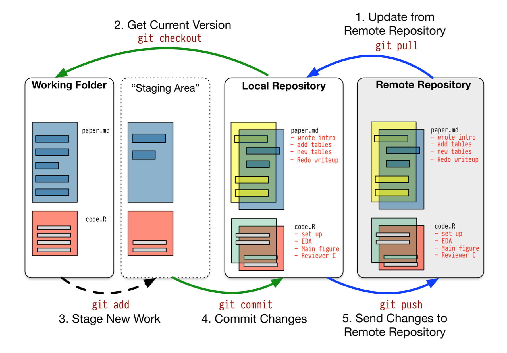
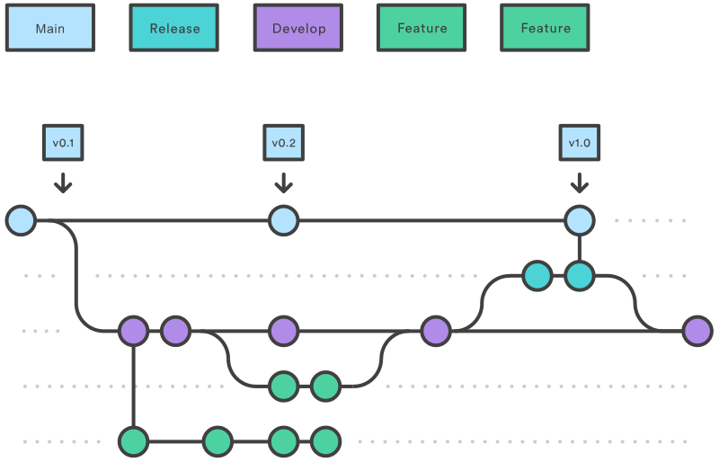

# 版本控制

{ width="70\%" }

# 为什么要用版本管理?

- 易于修改
- 错误回滚
- 团队协作
- 代码备份

# Git

- Linus Torvalds设计开发
- 使用最广泛的版本控制软件

{ width="50%" }

# Git文档教程

- [官方的教程][git_tutor]
- [GitHub教程][try_git] 
- [Awesome git][awesome_git]([中文][awesome_git_cn])

# Git工作流程(1)

{ width="60%" }

# Git工作流程(2)

{ width="60%" }

# Git工作流程(3)

{ width="60%" }

# Git工作流程(4)

{ width="60%" }

# 服务器

提供代码评审、issue管理，使得团队更为方便。

- [GitHub][github]
- [GitLab](https://gitlab.com)
- [码云](https://gitee.com)

# Markdown

- 文本形式，易于版本管理
- [GitHub的Markdown教程][github_markdown]
- [Markdown的文档、工具](https://github.com/mundimark/awesome-markdown)

[awesome_git]: https://github.com/dictcp/awesome-git
[awesome_git_cn]: https://github.com/hylerrix/awesome-git
[git]: https://git-scm.com/
[git_flow]: http://www.ruanyifeng.com/blog/2015/12/git-workflow.html
[git_intro]: https://rogerdudler.github.io/git-guide/index.zh.html
[git_tutor]: https://git-scm.com/book/zh/v2
[github]: https://github.com/
[github_markdown]: https://guides.github.com/features/mastering-markdown/
[markdown]: https://zh.wikipedia.org/zh-hans/Markdown
[try_git]: https://try.github.io/

