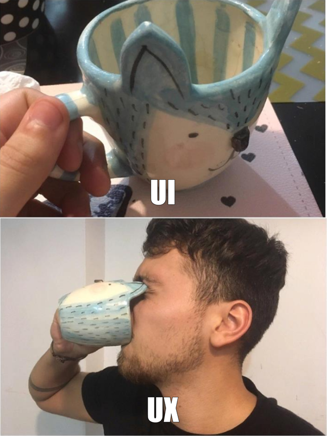

# UI vs UX

{ width="40%" }

# UI vs UX

{ width="80%" }

# 产品原型

- 产品设计方案的表达
- 产品设计界面的展示
- 功能与交互的示意
- 与其他人员沟通的依据

# 为什么做原型设计?

- 便于产品经理对产品的整体把握
- 能使产品需求评审更高效
- 进行产品的视觉设计和功能开发

# 需要考虑的问题

- 此原型的用户是谁？
- 原型需要达到的目的是什么？
- 用户的使用场景是什么？
- 需要提供什么样的用户体验？
- 后续的工作流程如何把握？

# 基本步骤

1. 分析产品功能（思维导图）
2. 根据产品功能，构建页面目录
3. 根据页面目录进行原型图绘制

# 原型设计工具

- [Axure RP][]
- [墨刀][modao]

# 设计原则、规范

- Android: [Material Design][]
- iOS: [Human Interface Guidelines][hig]
- [Awesome Design][]

# 本周作业

完成系统的原型设计，在docs工程中建立design目录，将原型设计的相关文档和资料放在该目录中。

[awesome design]: https://github.com/gztchan/awesome-design
[axure rp]: https://www.axure.com/
[hig]: https://developer.apple.com/design/human-interface-guidelines/ios/overview/themes/
[material design]: https://material.io/design/
[modao]: https://modao.cc/
