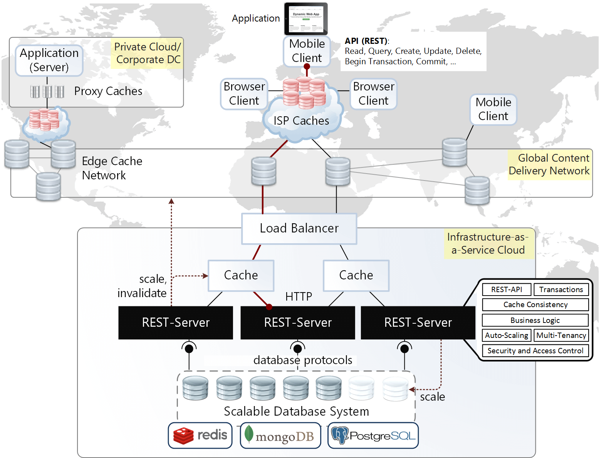
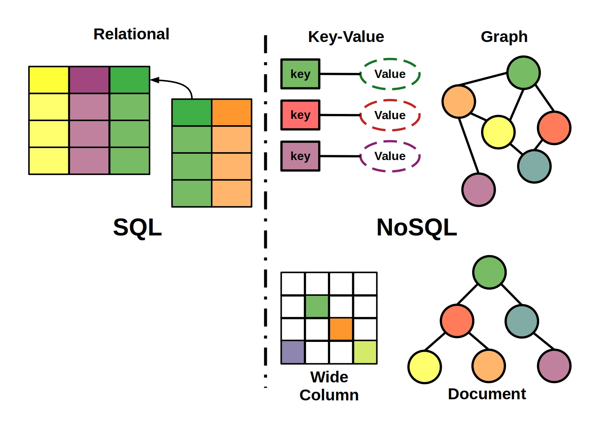
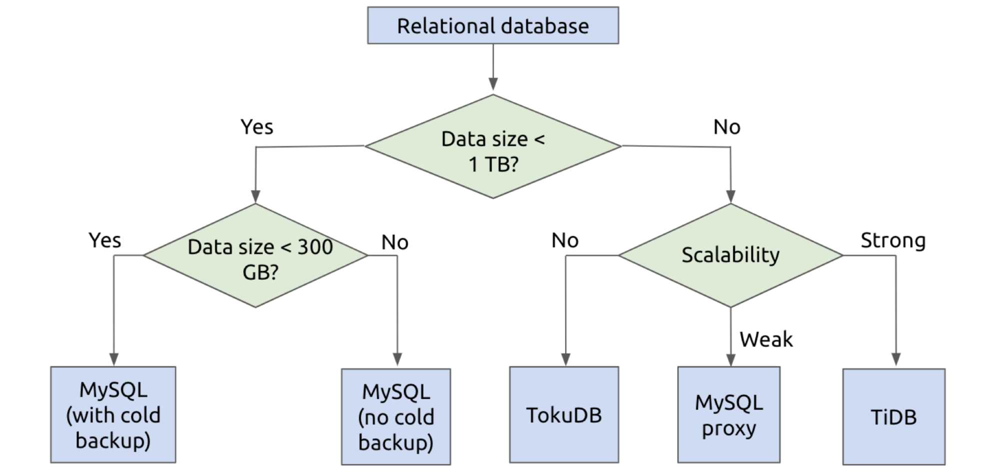
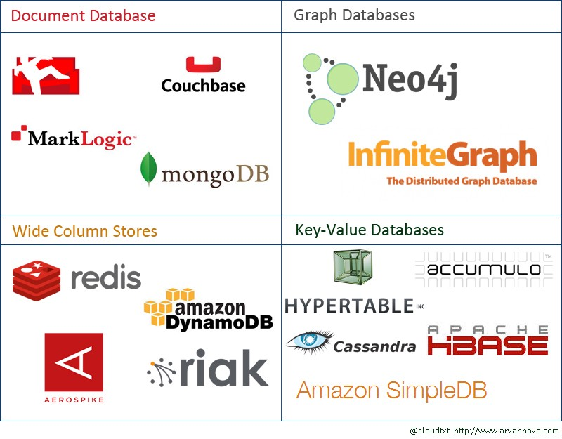
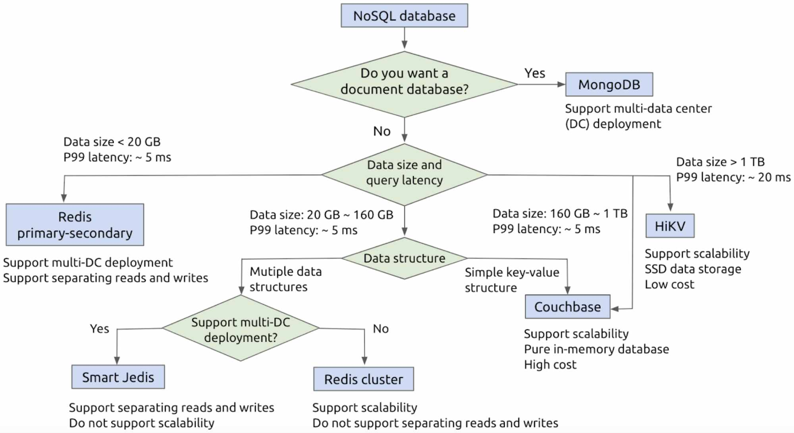

# 架构的演化

{ width="80%" }

# RESTful架构

{ width="70%" }

# RESTful

- [RESTful架构][restful]是移动互联网中最常用的技术
- 服务端和前端分离

# 数据库

{ width="70%" }

# 关系数据库

{ width="60%" }

# 关系数据库的选择

{ width="70%" }

# NoSQL

{ width="70%" }

# NoSQL的选择

{ width="80%" }

# Web框架

接收客户端的请求，处理后将结果返回给客户端

- Python: [Flask][]、[Django][]、[Tornado][]
- [Node.js][]: [Koa][]、[Express][]
- Ruby: [Ruby on Rails][ror]
- Go: [Beego][]、[Iris][]
- Java: [Spring MVC][spring_mvc]
- [PHP][]

# 服务端、客户端交互

- [RESTful API][restful]
- [RPC][]: [grpc][]、[thrift][]

# 移动端

- [Android][]
- [iOS][]
- [微信小程序](https://developers.weixin.qq.com/miniprogram/dev/framework/)
- Web技术: [自适应网页设计][responsive_design]，动态生成原生界面（[React Native][]、[Weex][]、[uni-app][]）

# Web开发

- [HTML][]: HTML定义了页面的主要结构
- [CSS][]: CSS用于实现页面的外观(参考[Bootstrap][]等[CSS框架][css_framework])
- [Javascript][]: [jQuery][]、[React][]、[Vue][]、[Angular][]

# BaaS

后端作为一种服务来提供给用户

- [Leancloud][]
- [Bmob](https://www.bmob.cn)
- [Firebase][]
- [Parse][]

# 本周任务

- 确定前端、后端的技术方案
- 完成前后端的模块设计
- 完成上述设计方案的文档及演示幻灯片(可用marp)

[android]: https://developer.android.com/?hl=zh-cn
[angular]: https://angular.io/
[baas]: https://en.wikipedia.org/wiki/Mobile_backend_as_a_service
[beego]: https://beego.me/
[bootstrap]: https://getbootstrap.com/
[css]: http://www.w3school.com.cn/css3/index.ASP
[css_framework]: https://github.com/troxler/awesome-css-frameworks
[django]: https://www.djangoproject.com/
[documentdb]: https://en.wikipedia.org/wiki/Document-oriented_database
[es6]: http://es6.ruanyifeng.com/
[express]: https://expressjs.com/zh-cn/
[firebase]: https://firebase.google.com/
[flask]: http://flask.pocoo.org/
[graphdb]: https://en.wikipedia.org/wiki/Graph_database
[grpc]: https://grpc.io/
[html]: https://www.w3schools.com/html/html5_intro.asp
[ios]: https://developer.apple.com/
[iris]: https://iris-go.com/
[javascript]: https://wangdoc.com/javascript/
[jquery]: https://jquery.com/
[koa]: https://koajs.com/
[kvdb]: https://en.wikipedia.org/wiki/Key-value_database
[leancloud]: https://leancloud.cn/
[mariadb]: https://mariadb.org/
[memcached]: https://memcached.org/
[mongodb]: https://github.com/mongo/mongo
[mysql]: http://mysql.com/
[node.js]: https://nodejs.org/en/
[nosql]: https://zh.wikipedia.org/wiki/NoSQL
[parse]: https://parseplatform.org/
[php]: http://php.net/
[postgresql]: http://www.postgresql.org/
[rdb]: https://zh.wikipedia.org/wiki/%E5%85%B3%E7%B3%BB%E6%95%B0%E6%8D%AE%E5%BA%93
[react native]: https://facebook.github.io/react-native/
[react]: https://reactjs.org/
[redis]: https://redis.io/
[responsive_design]: http://www.ruanyifeng.com/blog/2012/05/responsive_web_design.html
[restful]: http://www.ruanyifeng.com/blog/2011/09/restful.html
[rethinkdb]: https://github.com/rethinkdb/rethinkdb
[ror]: https://rubyonrails.org/
[rpc]: https://en.wikipedia.org/wiki/Remote_procedure_call
[spring_mvc]: https://docs.spring.io/spring/docs/current/spring-framework-reference/web.html 
[sqlite]: https://www.sqlite.org/index.html
[thrift]: https://thrift.apache.org/
[timedb]: https://en.wikipedia.org/wiki/Time_series_database
[tornado]: http://www.tornadoweb.org/en/stable/
[vue]: https://cn.vuejs.org/index.html
[weex]: https://weex.apache.org/cn/guide/
[uni-app]: https://github.com/dcloudio/uni-app
