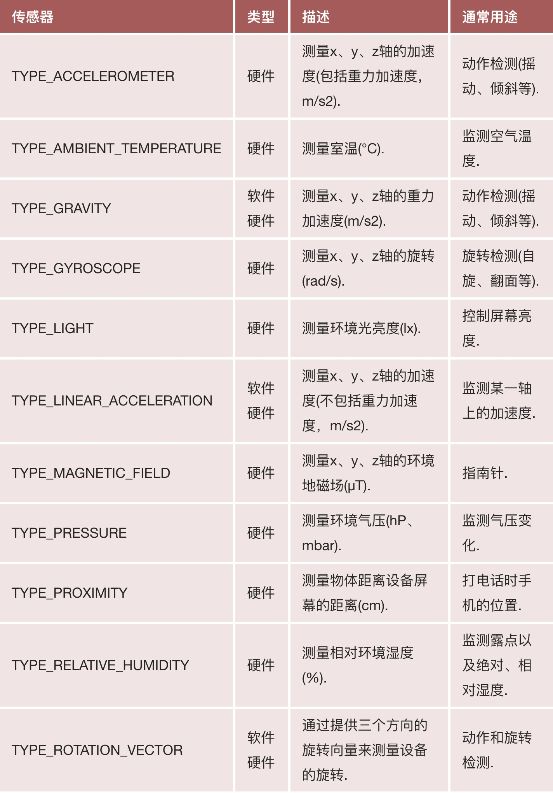

# 语言

- Kotlin（官方推荐语言）
- Java

# 框架

[Android Architecture Blueprints][arch]

- [Architecture Components](https://developer.android.google.cn/jetpack#architecture-components)（官方）
- [MVP][]
- [Clean][]

# Architecture Components

{ width=60% }

# [MVP][]

Model-View-Presenter, 由MVC架构演变而来的

![MVP 示意图][MVP_img]

# MVP

- View: 数据展示、界面、用户交互。Activity或Fragment作为View层。
- Model: 数据层，不仅仅是数据模型，还包括数据存取，如数据库的读写、网络数据请求等。
- Presenter: View与Model的桥梁，对业务逻辑进行处理。

# 为什么要用MVP?

- Model、View无法直接交互
- Presenter从Model获取数据，处理后由View层显示
- Presenter将View与Model隔离，View和Model之间不存在耦合，同时将业务逻辑从View中抽离。

# MVP vs. MVC

![MVC vs MVP][mvcmvp]

# [Clean][]

![mvp_clean][]

# Clean名词含义

- Entities：代表App的业务对象
- Use Cases：编排数据从 Entity 入或出的流，也叫交互器(Interactors)
- Presenters: 把原来方便 Use Cases 或者 Entity 使用的数据结构转换成需要的形式。Presenters 和 Controllers 都属于这里。
- External Interfaces：处理细节的地方：UI、工具（tools）、框架（framework）等

# Clean架构准则

- 框架独立，架构不依赖软件库
- 可测试性
- UI独立，在不改变系统其余部分的情况下完成对UI的简易更改
- 数据库独立，业务规则不绑定与某个具体的数据库当中，可以随意更换数据库
- 外部机制独立，业务规则完全不知道外层

# 其他架构

- [Dagger][]
- [RxJava][]
- [databinding][]
- [mvvm-live][]

# 传感器

{ width=40% }

# 位置信息

- [LBS][]
- [百度地图][baidu]
- [高德地图][amap]

~~~ xml
<manifest xmlns:android="http://schemas.android.com/apk/res/android"
    package="com.google.android.gms.location.sample.basiclocationsample" >

  <uses-permission android:name="android.permission.ACCESS_COARSE_LOCATION"/>
</manifest>
~~~

# 第三方库

- [一般的库][android-libs]
- [第三方的UI库][android-ui-libs]
- [App常用第三方库整理][hot-libs]
- C/C++写的库，可以使用[NDK][]

[amap]: https://lbs.amap.com/
[android-libs]: https://github.com/wasabeef/awesome-android-libraries
[android-ui-libs]: https://github.com/wasabeef/awesome-android-ui
[arch]: https://github.com/android/architecture-samples
[baidu]: http://lbsyun.baidu.com/index.php?title=androidsdk
[clean]: https://github.com/android/architecture-samples/tree/todo-mvp-clean/
[dagger]: https://github.com/android/architecture-samples/tree/todo-mvp-dagger/
[databinding]: https://github.com/android/architecture-samples/tree/todo-mvvm-databinding/
[hot-libs]: https://www.jianshu.com/p/4c28321def41
[lbs]: https://en.wikipedia.org/wiki/Location-based_service
[mvcmvp]: ./mvc_mvp.jpg
[mvp]: https://github.com/android/architecture-samples/tree/todo-mvp/
[mvp_clean]: ./mvp_clean.jpg
[mvp_img]: ./mvp.png
[mvvm-live]: https://github.com/android/architecture-samples/tree/todo-mvvm-live/
[ndk]: https://developer.android.com/ndk/
[rxjava]: https://github.com/android/architecture-samples/tree/todo-mvp-rxjava/
