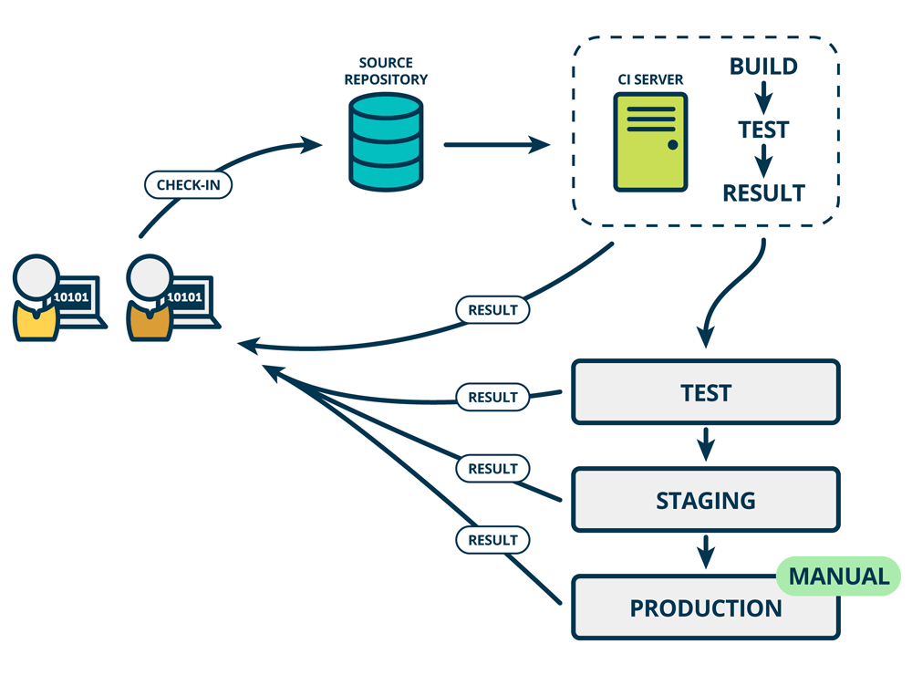

# 服务端部署

- 需部署到不同软硬件配置的机器上
- 系统本身有大量外部依赖
- 部署的复杂度日渐提高

# 配置管理

配置管理（英语：Configuration Management，简称 CM）是一个创建系统工程的过程，用来创建与维持一个产品，让这个产品的性能、功能，以及它所要求的物理特性，在它的生命周期中，都能保持稳定与一致性。

# CM软件

- [Ansible][]
- [Chef][]
- [Puppet][]

# 虚拟机

- 配置管理: 配置麻烦，难以保证开发环境和部署环境一致
- 虚拟机: 保证开发和部署过程使用的是相同的环境

# 虚拟机工具

- [Vagrant][]是基于虚拟机的开发工具
- [Openstack][]及大部分云平台都提供了虚拟机管理功能

# 容器技术

- 虚拟机缺点: 运行的开销较大
- 容器技术——特别是[Docker][]弥补了虚拟机的缺点

# Docker

- 可视为一个隔离的进程
- 开销和进程相当
- 满足用户对资源的隔离和虚拟
- 没有虚拟机功能强大，但满足了系统部署的大部分需求

# 容器工具

- 最热门的部署工具[Kubernetes][]
- [docker-compose][]
- [docker-swarm][]

# 持续集成

- 基于自动测试、部署技术
- 开发人员提交新代码之后，立刻进行构建、测试
- 根据测试结果，确定新代码能否正确集成

{ width=85% }

# 持续交付

- 将集成后的代码部署到「类生产环境」
- 如果代码没有问题，可以继续部署到生产环境中

{ width=60% }

# 持续部署

- 在持续交付的基础上
- 把部署到生产环境的过程自动化

{ width=60% }

[ansible]: https://www.ansible.com
[chef]: https://www.chef.io
[docker-compose]: https://docs.docker.com/compose/
[docker-swarm]: https://docs.docker.com/engine/swarm/
[docker]: https://www.docker.com
[kubernetes]: https://kubernetes.io/
[openstack]: https://www.openstack.org
[puppet]: https://puppet.com
[vagrant]: https://www.vagrantup.com
